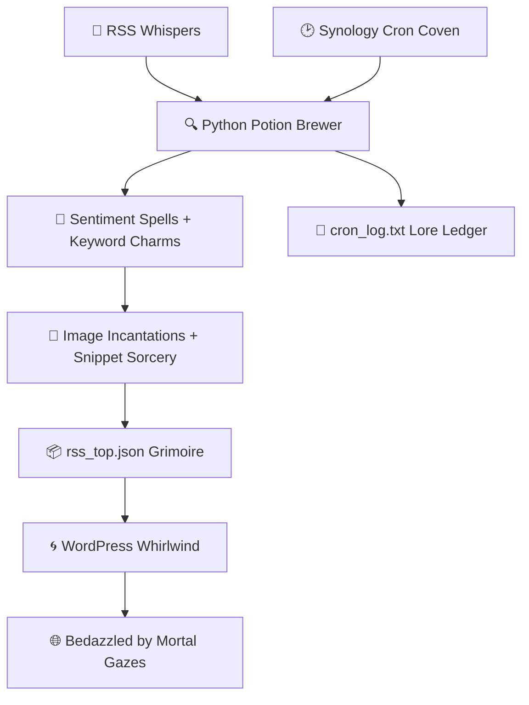

# 📰 QMTRY — The RSS Whisperer Extraordinaire 🎩✨
**Alchemizing Headlines into Pure, Auditable Enchantment. Poof! Magic Meets Meticulous.**

---
## 💡 Quick Quip of a Description
**Handpicked healthcare RSS whispers → slyly sorted by zing → twirled into a carousel of captivating clout.**
This whimsical wizardry fuels [QMTRY.ai](https://qmtry.ai)'s front-page frolic with a daily sextet of stellar stories, ranked by sentiment spells, keyword charms, and visual verve — all brewed in Python potions, Synology sorcery, and WordPress wand-waving.
---
## 📖 What's the Spell Here, and Why Bother Brewing It?
Amidst the stormy seas of AI fluff and healthcare hocus-pocus, **QMTRY** beams as your cheeky beacon of brilliance. 🏰✨
This repo conjures a *sophisticated-yet-sassy* symphony:
- 📬 **RSS Roundup** from elite healthcare haunts (no riff-raff allowed)
- 🧠 **Sentiment Sorcery** via VADER — the NLP ninja, not the dark-side dad joke
- 🎨 **Image & Snippet Snatching** (because bland feeds? Total buzzkill bandits)
- 🎯 **Elite Six Selection** by keywords, categories, and that indefinable *je ne sais quoi*
- 🧼 **JSON Juju** → `/wp-content/uploads/rss/rss_top.json` (neat as a pixie's pantry)
- 🌀 **Whirling WordPress Wonderland** with badges, timestamps, and sparkly shimmers
- 🔁 **Synology Cron Conjuring** — banishing manual meddling to the shadows
- 📈 **Logbook of Lore + Vigilant Watch** for that audit-proof aura
**✨ The Enchanting Epilogue?**
Your homepage carousel leaves onlookers spellbound:
_"Egads! What wizard weaves this web? This site's got the scoop on scoops!"_ 🧙‍♂️
---
## 🛠️ Magical Toolkit
| Gizmo | Gist |
|-------|------|
| `qmtry_rss_collector.py` | RSS rustling, VADER vibe-checks, and clever culling |
| `rss_top.json` | The golden grimoire of top tales (capped at a sly six) |
| `run_rss_collector.sh` | The cron-calling incantation for Synology shenanigans |
| `cron_log.txt` | Scribbles of spells cast, for debugging daydreams |
| WordPress Shortcode | Summons the carousel with `[qmtry_top_rss]` — abracadabra! |
| Synology Task Scheduler | Daily dawn ritual at 07:00 AM, like clockwork... or witchcraft |
---
## 🔁 Enchantment Flowchart

